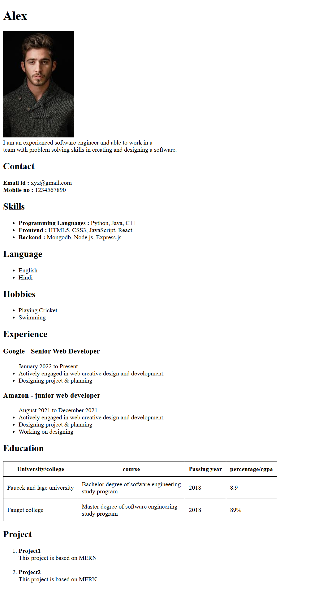
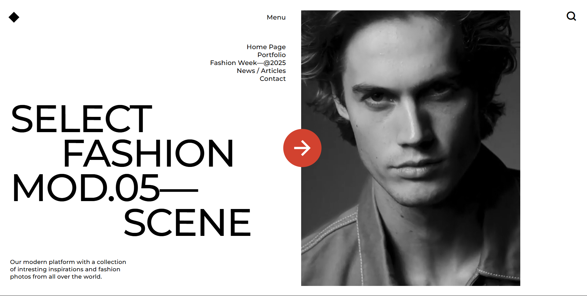

# HTML Folder

## Resume Project

### Project Description

This project is a simple and clean **Resume webpage** built using HTML and inline CSS. It showcases a personal profile including:

- Name and profile picture
- Contact information (email and phone)
- Skills in programming languages, frontend, and backend technologies
- Languages spoken
- Hobbies
- Work experience details
- Education in a tabular format
- Projects overview

The resume is designed to be clear and structured for easy readability.

---

### Output Preview

---

### Responsiveness

- The current design uses simple HTML and CSS without advanced responsive techniques.
- It works well on desktop and tablets.
- For mobile devices, some layout adjustments may be necessary to improve the user experience (e.g., responsive images, flexible layout).

---

### Live Demo

<a href="https://resume-by-html.netlify.app/" target="_blank">👉 Resume Project Live Link</a>

---

## Tribute Project

### Project Description

This project is a **Tribute Webpage** dedicated to **Dr. A.P.J. Abdul Kalam**, the Missile Man of India and the 11th President of the country. The page includes:

- A title and quote summarizing his legacy
- Internal navigation links for easy section jumping
- A profile image linked to a high-resolution version
- A detailed timeline of his life and contributions
- A list of motivational quotes
- An external link to his Wikipedia profile

---

### Output Preview

*(Click the image for the full-size version)*

---

### Responsiveness

- The webpage is built using basic HTML and minimal inline CSS.
- It is **partially responsive**:
  - Works fine on desktops and tablets.
  - Minor layout issues may appear on smaller mobile devices (e.g., text overflow or image scaling).

---

### Live Demo

<a href="https://tribute-apjkalam.netlify.app/" target="_blank">👉 View Tribute Project Live</a>

---

# CSS Folder

### Project Description

This is a visually stunning **Fashion Look Landing Page** created using **HTML5 and CSS3**, with integrated video backgrounds and responsive layouts. The webpage captures a high-end editorial aesthetic often seen in fashion websites.

#### Key Features:

- Bold typography and split layout design
- Background video element playing automatically (muted and looped)
- Stylized logo using CSS rotation
- Minimalist menu with icons via [Remix Icon](https://remixicon.com/)
- Eye-catching central arrow button (animated layout element)
- Responsive design tailored for mobile screens

---

### Output Preview

---

### Responsiveness

- Designed to adapt to both **desktop and mobile screens**
- Mobile adjustments include:
  - Collapsed navigation and replaced with hamburger icon
  - Resized typography
  - Video section retains responsiveness
  - Central arrow reorients for vertical scrolling

---

### External Assets Used

- 🎨 Fonts: [Google Fonts - Montserrat](https://fonts.google.com/specimen/Montserrat)
- 🧩 Icons: [Remix Icon CDN](https://remixicon.com/)
- 🎥 Video: `video.mp4` (ensure it's placed in the same directory as `index.html`)

---

### Live Demo

<a href="https://fashionlook.netlify.app/" target="_blank">👉 FashionLook Project Live Link</a>

---