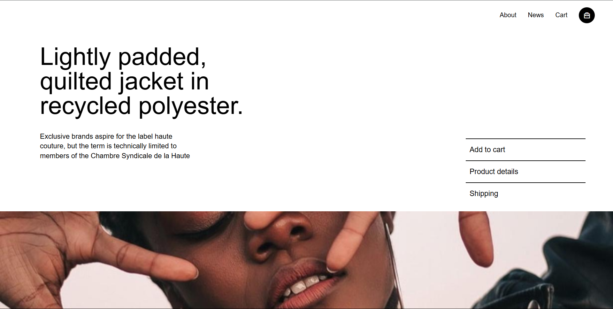
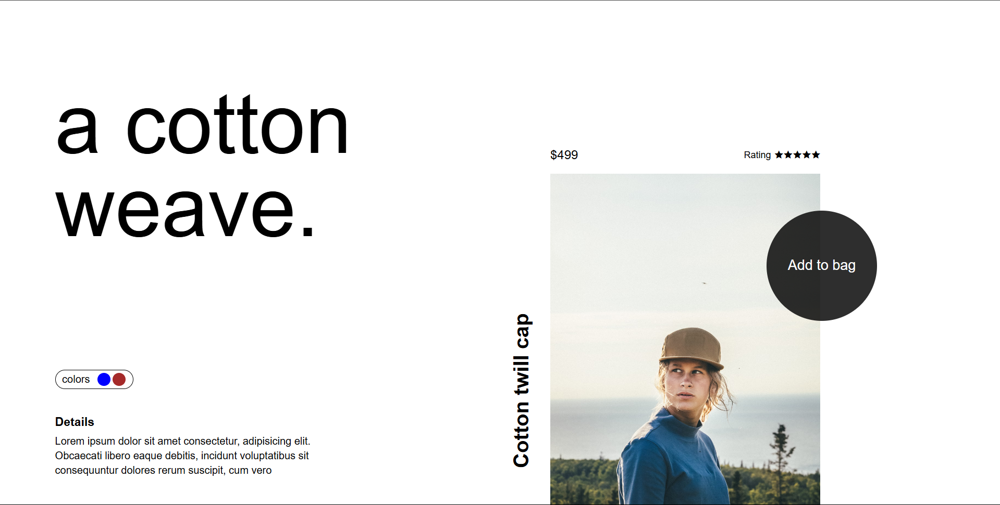
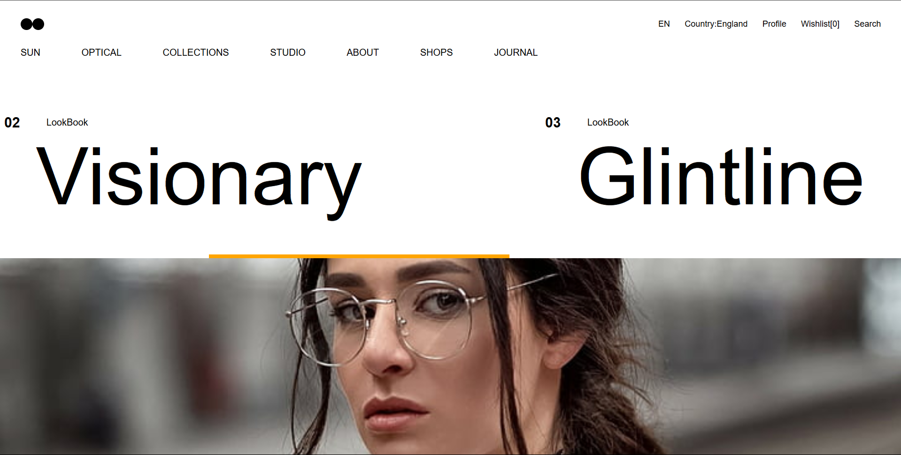

# HTML Folder

## Resume Project

### Project Description

This project is a simple and clean **Resume webpage** built using HTML and inline CSS. It showcases a personal profile including:

- Name and profile picture
- Contact information (email and phone)
- Skills in programming languages, frontend, and backend technologies
- Languages spoken
- Hobbies
- Work experience details
- Education in a tabular format
- Projects overview

The resume is designed to be clear and structured for easy readability.

---

### Output Preview

---

### Responsiveness

- The current design uses simple HTML and CSS without advanced responsive techniques.
- It works well on desktop and tablets.
- For mobile devices, some layout adjustments may be necessary to improve the user experience (e.g., responsive images, flexible layout).

---

### Live Demo

<a href="https://resume-by-html.netlify.app/" target="_blank">👉 Resume Project Live Link</a>

---

## Tribute Project

### Project Description

This project is a **Tribute Webpage** dedicated to **Dr. A.P.J. Abdul Kalam**, the Missile Man of India and the 11th President of the country. The page includes:

- A title and quote summarizing his legacy
- Internal navigation links for easy section jumping
- A profile image linked to a high-resolution version
- A detailed timeline of his life and contributions
- A list of motivational quotes
- An external link to his Wikipedia profile

---

### Output Preview

---

### Responsiveness

- The webpage is built using basic HTML and minimal inline CSS.
- It is **partially responsive**:
  - Works fine on desktops and tablets.
  - Minor layout issues may appear on smaller mobile devices (e.g., text overflow or image scaling).

---

### Live Demo

<a href="https://tribute-apjkalam.netlify.app/" target="_blank">👉 View Tribute Project Live</a>

---

# CSS Folder

## Fashion Look

This is a visually stunning **Fashion Look Landing Page** created using **HTML5 and CSS3**, with integrated video backgrounds and responsive layouts. The webpage captures a high-end editorial aesthetic often seen in fashion websites.

### Key Features:

- Bold typography and split layout design
- Background video element playing automatically (muted and looped)
- Stylized logo using CSS rotation
- Minimalist menu with icons via [Remix Icon](https://remixicon.com/)
- Eye-catching central arrow button (animated layout element)
- Responsive design tailored for mobile screens

---

### Output Preview

---

### Responsiveness

- Designed to adapt to both **desktop and mobile screens**
- Mobile adjustments include:
  - Collapsed navigation and replaced with hamburger icon
  - Resized typography
  - Video section retains responsiveness
  - Central arrow reorients for vertical scrolling

---

### External Assets Used

- 🎨 Fonts: [Google Fonts - Montserrat](https://fonts.google.com/specimen/Montserrat)
- 🧩 Icons: [Remix Icon CDN](https://remixicon.com/)
- 🎥 Video: `video.mp4` (ensure it's placed in the same directory as `index.html`)

---

### Live Demo

<a href="https://fashionlook.netlify.app/" target="_blank">👉 FashionLook Project Live Link</a>

---
## Shop Jacket

A sleek and stylish product landing page for a **Shop Jacket** concept, inspired by modern e-commerce UI trends. This project uses **HTML5** and **CSS3** to create a clean, functional, and aesthetically minimal interface—ideal for clothing or fashion product showcases.

### Key Features:

- Elegant hero text section introducing the product
- Clean navbar with cart icon and simplified options
- Interactive section for:
  - Add to Cart
  - Product Details
  - Shipping Info
- Smooth hover effects with visible arrow icon on hover
- Responsive layout (non-flex on mobile screens not yet implemented—could be added)

---

### Output Preview

---

### Responsiveness

### Responsiveness

- Designed to work primarily on **desktop screens** with clean layout and spacing  
- Mobile responsiveness is **not fully implemented** yet  
- Future improvements may include:  
  - Collapsing navigation menu into a hamburger icon for small screens  
  - Adjusting typography sizes for better readability on mobile  
  - Making interactive sections stack vertically instead of side-by-side  
  - Ensuring background images resize and reposition smoothly on smaller devices  

---

### External Assets Used

- 🧩 Icons: [Remix Icon](https://remixicon.com/)
- 📷 Image: `image.png` as product showcase background

---

### Live Demo

<a href="https://jacket-shoping.netlify.app/" target="_blank">👉 Shop Jacket Project Live Link</a>

---

##  Cotton Weave

This is a sleek and modern **Cotton Weave Product Landing Page** crafted with **HTML5 and CSS3**. The layout evokes a clean, minimal aesthetic suitable for showcasing premium apparel or accessory items.

---

###  Key Features:

- Elegant **split-layout design** with a clear product focus
- Stylized **"Add to Bag"** CTA within a floating circular container
- Clean typography with a fashion-forward grid structure
- Subtle **color palette selector**
- Integrated **Remix Icons** for star ratings

---
### Output Preview

---

###  Responsiveness

- Not Fully responsive and across **mobile screens**
- For smaller screens:
  - Grid layout stacks vertically
  - Font sizes adjust for readability
  - "Add to Bag" and product image areas reposition smartly

---

### External Assets Used

- 🎨 Fonts: System default sans-serif
- 🧩 Icons: [Remix Icon CDN](https://remixicon.com/)
- 🖼️ Image: Product background from [Unsplash](https://unsplash.com/)
  - [Image Source](https://images.unsplash.com/photo-1623953939152-c551dfdabe99?q=80&w=1974&auto=format&fit=crop&ixlib=rb-4.1.0&ixid=M3wxMjA3fDB8MHxwaG90by1wYWdlfHx8fGVufDB8fHx8fA%3D%3D)

---

### Live Demo

<a href="https://weave-cotton.netlify.app/" target="_blank">👉 Cotton Weave Project Live Link</a>

---

## TrendLine 

> A smooth and minimal horizontal scroll landing page for a conceptual eyewear brand – **TrendLine**. Inspired by premium brand UI designs.

### Key Features

- Elegant horizontal scroll layout with large typography
- Fixed navigation menus (top 1 and 2)
- Smooth product headline transitions
- Background cover image section
- Responsive (add media queries for mobile support)
- Inspired by a Dribbble concept

---
### Output Preview

---
## 📱 Responsiveness

🔶 Currently optimized for **desktop view**.

To make it mobile responsive, consider adding the following:
- Use `@media` queries to adjust layout
- Stack navigation items vertically
- Reduce font sizes for `.lines #part2 h1`

You can request the mobile fix code if needed.

---

### Live Demo

<a href="https://trendline-dribbble.netlify.app/" target="_blank">👉 Trendline Project Live Link</a>

---

